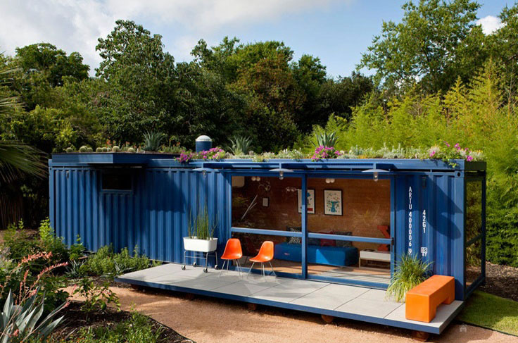

### EDA: Viabilidad de las Passivhaus Modulares en Zonas Rurales en Madrid

Este analisis de datos surge como investigacion y apoyo a un futuro proyecto de emprendimiento en el sector Empresarial y en el sector de la fabricacion de viviendas de tipo casas Passivhauss - Modulares (casas contenedor). En el busco mediante un analisis exhaustivo verificar la viabilidad de este tipo de vivienda mediante la relacion coste-beneficio de la misma.

Para ello eh accedido a informacion de las siguientes paginas web:
Fotocasa
Instituto Nacional de Estadistica
Datos de la Comunidad de Madrid
Datos del Banco de Datos de la Comunidad de Madrid

Extraccion de los datos, procesamiento de los mismos: 
Descarga de datos formato xls.
Descarga de datos formato csv.
Web Scraping con la libreria Beautiful soup
Para acceder a ver la bibliografia te dejo aqui el enlace: [datos](https://github.com/DaianaSaenz/EDA-CASAS-CONTENEDOR/tree/main/src/data).

El analisis:
Libreria Pandas
Libreria Numpy
Libreria requests

Resultados visualizados en Graficas:
Libreria de Python Matplotlib

ingresa en : para observar los resultados de este analisis
Para acceder a este contenido te dejo aqui el enlace: 

- 📫 How to reach me **daiana-20-@gmail.com**

- :gem: Mi perfil en [Linkedin](https://www.linkedin.com/in/daiana-noelia-saenz)